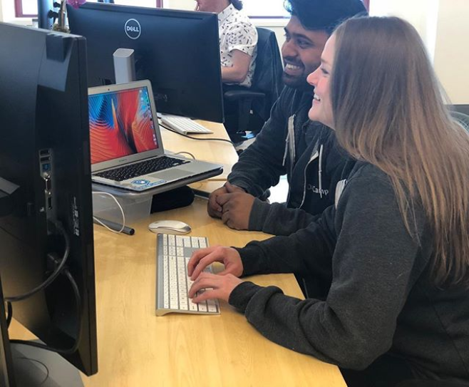

### Becca Robins

Hi there 👋, I'm Becca. I'm a Brooklyn-based Content Program Manager @ Microsoft. I help build Microsoft 365 training content in the Security, Compliance, and Management space on Microsoft Learn. Previously, I worked at DataCamp, where I helped develop data science courses focused on Python, R, SQL, and Google Sheets.

<!--

-->

🔭 I’m currently working on: getting an MBA!  
🌱 I’m currently learning: American Sign Language  
💬 Ask me about: content, accessibility, and learning  
📫 How to reach me: [Becca Robins on LinkedIn](https://www.linkedin.com/in/beccarobins/)  
😄 Pronouns: She/Her  
⚡ Fun fact: I've lived in 3 countries and 4 states

<!--
**beccarobins/beccarobins** is a ✨ _special_ ✨ repository because its `README.md` (this file) appears on your GitHub profile.

Here are some ideas to get you started:

- 🔭 I’m currently working on ...
- 🌱 I’m currently learning: ...
- 👯 I’m looking to collaborate on: ...
- 🤔 I’m looking for help with: ...
- 💬 Ask me about: ...
- 📫 How to reach me: ...
- 😄 Pronouns: ...
- ⚡ Fun fact: 
-->
