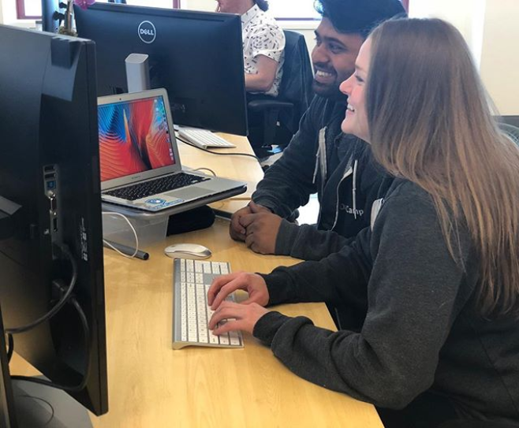

### Becca Robins

Hi there 👋, I'm Becca. I'm a Brooklyn-based tech professional focused on data and analytics. I've worked at Microsoft, where I helped build Power BI reports for internal customers and at DataCamp, where I helped develop data science courses focused on Python, R, SQL, and Google Sheets.

<!--

-->

🔭 **I recently:** passed my PL-300 Power BI Data Analyst Associate certification  
🌱 **I'm currently learning:** Tableau  
💬 **Ask me about:** process improvement  
📫 **How to reach me:** [Becca Robins on LinkedIn](https://www.linkedin.com/in/beccarobins/)  
😄 **Pronouns:** She/Her  
⚡ **Fun fact:** I'm a big theater nerd :performing_arts:

I also have a blog built in GitHub, which you can read here: [Content&mdash;Technically](https://beccarobins.github.io)
 

Below are contribution graphs from commits made in repos hosted outside GitHub.
<!--
**beccarobins/beccarobins** is a ✨ _special_ ✨ repository because its `README.md` (this file) appears on your GitHub profile.

Here are some ideas to get you started:

- 🔭 I’m currently working on ...
- 🌱 I’m currently learning: ...
- 👯 I’m looking to collaborate on: ...
- 🤔 I’m looking for help with: ...
- 💬 Ask me about: ...
- 📫 How to reach me: ...
- 😄 Pronouns: ...
- ⚡ Fun fact: 
-->

<!--

-->

<!--

-->
